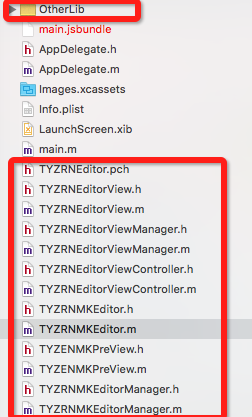
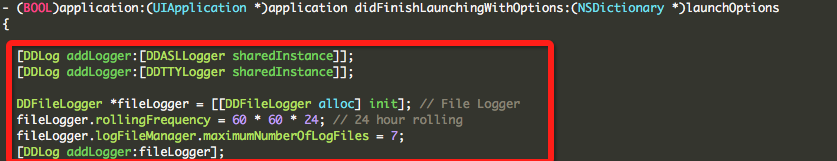
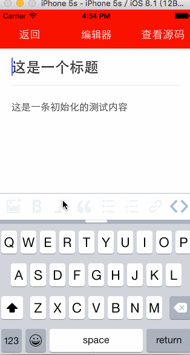

# TYZRNEditor
React-Native与Native UI相结合的 可用于iOS的 富文本编辑器与Markdown编辑器

#####基于以下库修改并封装

|库名称|
|----|
|[AFNetworking](https://github.com/AFNetworking/AFNetworking/)|
|[CocoaLumberjack](https://github.com/CocoaLumberjack/CocoaLumberjack/)|
|[MMMarkdown](https://github.com/mdiep/MMMarkdown)|
|[Moleskine](https://github.com/shiweifu/Moleskine)|
|[NSObject-SafeExpectations](https://github.com/wordpress-mobile/NSObject-SafeExpectations)|
|[WordPress-Editor-iOS](https://github.com/wordpress-mobile/WordPress-Editor-iOS)|

#####React-Native组件
* TYZRNEditorView：富文本编辑器
* TYZRNMKEditor：Markdown编辑器

#####使用方式
由于在打包静态库时发生XIB文件无法打包的问题，导致暂时无法发布到npmjs使用。
所以有如下方式可以引进：
1.下载工程
2.将TYZRNEditorView.js与TYZRNMKEditor.js copy工程相应目录
3.XCode工程设置：
> 必须包含如下文件：
> 

>AppDelegate加入LOG设置（第三方库必须使用）：
>

>PCH中包含工程编译所要用到的必须头文件

######在React-Native中如何使用
富文本编辑器的使用方法

	//该路径可根据实际路径进行处理
	var TYZRNEditorView = require('./TYZRNEditorView');
    ...
    render: function() {
		return (

			< TYZRNEditorView style = {
				styles.contentStyle
			}
			ref = 'EditorView'
			contentStr = '这是一条初始化的测试内容'
			titleStr = '这是一个标题'
			backAction = {
				this._backAction
			}
			/>
		);
	}
    ...

>__backAction__ function
>从编辑器界面点击返回按钮的事件处理
>__titleStr__ string
>所要编辑的文章标题
>__contentStr__ string
>文章内容
>
>######contentStr与titleStr也可以从TYZRNEditorView的state中获取

Markdown编辑器的使用方法
	
    //该路径可根据实际路径进行处理
	var TYZRNMKEditor = require('./TYZRNMKEditor');
    ...
    render: function() {
		return (

			<TYZRNMKEditor style={styles.contentStyle} 
							ref='EditorView' 
							defaultMarkdownText = '##这是一条初始化的测试内容'
							backEvent={this._backEvent}
							/>
		);
	}
    ...

>__backEvent__ function
>从编辑器界面点击返回按钮的事件处理
>__defaultMarkdownText__ string
>文章内容
>
>

